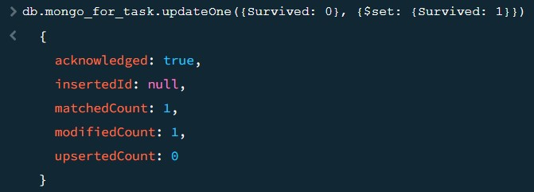
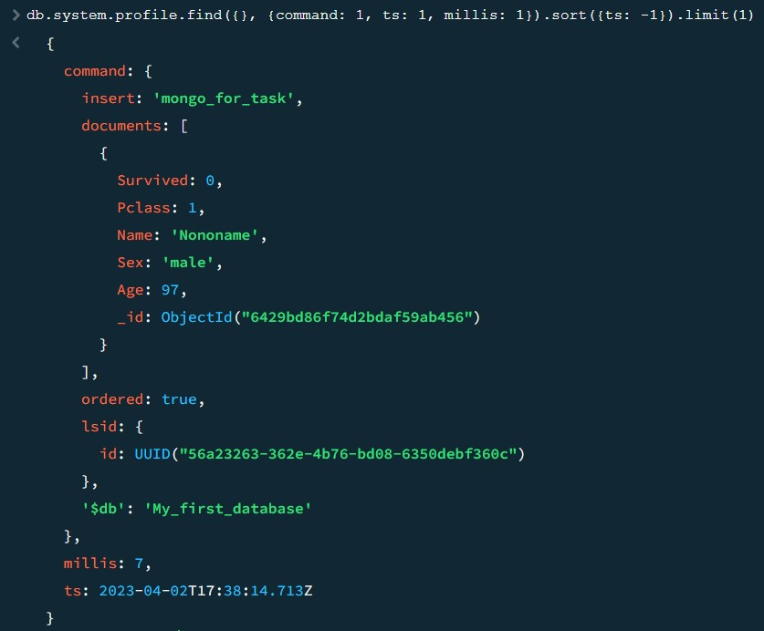

# MongoDB и CRUD операции
## Создание базы данных
Создаю базу данных и заполняю её датасетом номер 9 из [предложенных датасетов](https://cloud.docs.scylladb.com/stable/scylladb-basics/).

## CRUD операции
### Операция вставки

Время выполнения ~ 0 мс:

### Операция поиска

Время выполнения ~ 1 мс:

### Операция обновления

Время выполнения ~ 11 мс:

### Операция удаления

Время выполнения ~ 6 мс:

## CRUD операции с созданием индекса

### Создание индекса

### Операция вставки

Время выполнения ~ 7 мс:

### Операция поиска

Время выполнения ~ 0 мс:

### Операция обновления

Время выполнения ~ 1 мс:

### Операция удаления

Время выполнения ~ 7 мс:

## Сравнение производительности запросов выборки

Из таблицы видно, что после создания индекса, операция обновления произвелась на 10 мс быстрее, в то время как операция вставки, наоборот, стала работать медленне на 7 мс. Остальные операции отличаются по времени незначительно. Из этого нельзя сделать определённый вывод в силу того, что документов в коллекции не так много, только 887 штук. Но по оперции обновления и её сложности отностельно других операций, можно предположить, что индексы, действительно, должны оптимизировать CRUD операции и делать их быстрее.

