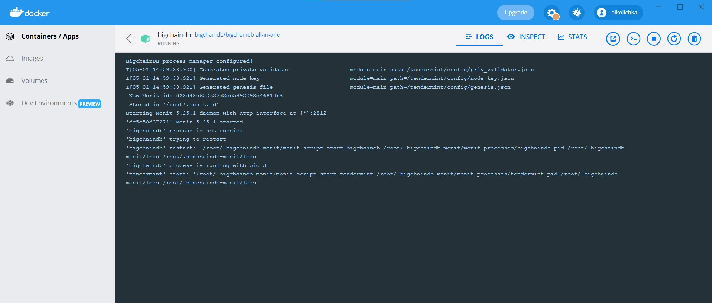

# BigchainDB
## _1) История развития СУБД_

BigchainDB была основана в Берлине в 2014 году Гидеоном Гринбергом, Кристианом Лундквистом, Федором Богомоловым, Винсентом Чарватом и Мартином Кёнзом. Идея компании состояла в разработке распределенной базы данных на основе блокчейн-технологий, которая обеспечивала бы безопасное и прозрачное хранение цифровых активов. Со временем компания сместила свое направление на создание следующего поколения блокчейнов с более высоким уровнем масштабируемости и эффективности, чтобы удовлетворить потребности различных отраслей и приложений. Сегодня BigchainDB является одним из ведущих стартапов в области блокчейн-технологий, и их решения используются в таких отраслях, как здравоохранение, голосования, закупки, и многих других.


## _2) Инструменты для взаимодействия с СУБД_

BigchainDB предоставляет несколько инструментов для взаимодействия с СУБД: 
1. BigchainDB Driver: это официальный драйвер BigchainDB, который разработан на языке Python и обеспечивает простой доступ к функциям BigchainDB.
2. BigchainDB.js: Это библиотека JavaScript для работы с BigchainDB. Он позволяет разработчикам создавать децентрализованные приложения, используя браузер или сервер.
3. BigchainDB CLI: Это инструмент командной строки, который облегчает взаимодействие с BigchainDB. Он позволяет выполнить такие задачи, как создание аккаунтов, перевод активов и т.д.
4. BigchainDB Python Server: Это Python-реализация BigchainDB, которая можно использовать для создания собственной распределенной базы данных. Он обеспечивает богатый набор возможностей для управления активами, как структурированными (например, данные о транспортных средствах), так и неструктурированными активами (например, фотографии).
5. BigchainDB Studio: это веб-интерфейс для работы с BigchainDB. Он обладает функционалом, позволяющим управлять активами, конфигурацией сети, созданием новых пользователей и многое другое. Любой желающий может развернуть студию на своем компьютере или сервере.


## _3) Какой database engine используется в вашей СУБД?_

BigchainDB использует базу данных MongoDB в качестве своего database engine. Он использует гибридный подход, объединяя возможности блокчейна и MongoDB, чтобы создать новое поколение распределенных баз данных. Благодаря этой технологии BigchainDB обеспечивает высокую производительность при обработке транзакций и эффективное управление активами. В частности, благодаря MongoDB, BigchainDB может хранить большие объемы данных, быстро их обрабатывать и обеспечивать масштабируемость на неопределенный период времени. Благодаря этим преимуществам, BigchainDB стал одним из ведущих блокчейн-решений, обладающим широкой функциональностью для удовлетворения различных потребностей и задач.


## _4) Как устроен язык запросов в вашей СУБД? Разверните БД с данными и выполните ряд запросов._
Язык запросов в BigchainDB основан на языке Python. Он содержит методы API, позволяющие осуществлять запросы к базе данных для создания, отправки и манипулирования активами.

> Пример успешного развёртывания BigchainDB в Docker


> Пример успешного развёртывания BigchainDB на Ubuntu


> Пример создания актива


> Пример создания актива без использования `bigchain_driver`


>Пример обращения к несуществующей транзакции


Пример не полностью удачного создания транзакции из-за тайм-аута (подозрение в проблемах работы сервера bigchaindb)


## _5) Возможно ли распределение файлов БД по разным носителям?_

Да, в BigchainDB возможно распределение файлов базы данных по разным носителям. Это называется расщеплением базы данных (database sharding) и является распространенной техникой среди блокчейн-систем.
Разбиение базы данных на несколько частей позволяет улучшить производительность системы, поскольку разные участки базы данных могут храниться на разных серверах или устройствах, что позволяет балансировать нагрузку и распределить ее между разными компонентами.
Расщепление базы данных может происходить по различным критериям, например, по группировке данных по определенным параметрам или по определенным участкам базы данных. Для того чтобы реализовать такую систему, необходимо использовать специальные протоколы и механизмы репликации данных в сети.
BigchainDB предоставляет возможность расщеплять базу данных по различным критериям, таким как идентификатор пользователей или идентификатор активов. Все участки базы данных могут быть хранены на разных устройствах или серверах, что позволяет распределить нагрузку на систему и повысить ее производительность.
Таким образом, распределение файлов базы данных по разным носителям в BigchainDB не только возможно, но и является одним из ключевых механизмов для улучшения производительности системы.
> В данном примере мы создаем два участка базы данных и распределяем транзакции по каждому участку в соответствии с адресом активов. Затем мы распределяем участки базы данных на разные сервера, используя несколько экземпляров BigchainDB и устанавливаем у них разные ключи для подписи транзакций. Это позволяет нам распределять нагрузку между разными устройствами и повышать производительность системы.


## _6) На каком языке/ах программирования написана СУБД?_
BigchainDB написан на языке Python. Он использует некоторые популярные библиотеки Python, такие как Flask, MongoDB и Tendermint, для реализации функций управления данными, запуска блокчейн сети и поддержки смарт-контрактов. Кроме того, BigchainDB предоставляет API и SDK для работы с ним на разных языках программирования, таких как JavaScript, Java, TypeScript и др.


## _7) Какие типы индексов поддерживаются в БД? Приведите пример создания индексов._
BigchainDB поддерживает несколько типов индексов. Рассмотрим основные типы индексов в BigchainDB:

1.Одним из наиболее распространенных типов индексов является индекс по высоте блока (block height). Этот индекс позволяет быстро и просто находить блоки в базе данных на основе их высоты.
Пример создания индекса по высоте блока:
```sql
CREATE INDEX blockheight_index ON blocks(height);
```
2. Text Indexes используются для поиска текстовых значений. Они особенно полезны для поиска определенных слов в метаданных. Это можно использовать для того, чтобы быстро находить активы, связанные с конкретным человеком или компанией.
Пример создания текстового индекса на base_asset.metadata.OWNER:
```sql
CREATE TEXT INDEX asset_owner_index ON assets(base_asset.metadata.OWNER);
```
3. Unique Indexes используются для индексации данных, которые имеют уникальный идентификатор. Эти индексы могут использоваться для проверки наличия дубликатов или уникальности записей.

Пример создания уникального индекса на asset_id:
```sql
CREATE UNIQUE INDEX asset_id_index ON assets(id);
```

4. Composite Indexes (комбинированные индексы) - это индексы, которые совмещают в себе несколько полей в одном индексе. Они используются для быстрого выполнения запросов, которые используют несколько условий. Например, можно создать индекс, который индексирует активы, где ключевое свойство метаданных содержит определенное значение, и при этом актив был создан в определенном блоке.

Пример создания комбинированного индекса на базе блока и ключевого свойства метаданных:
```sql
CREATE INDEX block_and_metadata_index ON assets(create_tx.block_number, id, base_asset.metadata.KEY_PROPERTY);
```
Ещё одним из способов создания индексов в BigchainDB является использование языка запросов MongoDB. 
- Создание индекса по высоте блока:
```python
db.blocks.createIndex({height: 1})
```
- Создание текстового индекса на метаданные:
```python
db.assets.createIndex({"base_asset.metadata": "text"})
```
- Создание уникального индекса на asset_id:
```python
db.assets.createIndex({id: 1}, {unique: true})
```

- Создание комбинированного индекса на базе блока и ключевого свойства метаданных:
```python
db.assets.createIndex({"create_tx.block_number": 1, id: 1, "base_asset.metadata.KEY_PROPERTY": 1})
```

Кроме того, BigchainDB также поддерживает создание индексов через язык запросов JSON. Пример создания уникального индекса на asset_id через JSON-RPC:
```python
{
  "method": "index_create",
  "params": {
    "index": {
      "filter": {
        "public": true,
        "definition.id": "single_asset"
      },
      "kwargs": {
        "fields": ["id"],
        "unique": true
      }
    }
  },
  "id": 2
}
```

## _8) Как строится процесс выполнения запросов в вашей СУБД?_
Процесс выполнения запросов в BigchainDB применяет технологию распределенной базы данных, основанной на блокчейне, которая предоставляет безопасный и прозрачный способ управления данными. Каждый запрос в BigchainDB является транзакцией, которая сохраняется в блокчейне.
Например, рассмотрим процесс создания нового актива в BigchainDB и последующей передачи этого актива от одного участника к другому:
> Шаг 1: Создание актива

- Пользователь генерирует пару ключей (публичный и приватный)
- Пользователь использует свой приватный ключ для создания транзакции создания актива с определенными данными актива
- Эта транзакция подписывается с помощью приватного ключа, и результат подписания отправляется в сеть для проверки
- Когда транзакция проверена и подтверждена в блокчейне, то актив считается созданным в BigchainDB
> Шаг 2: Обновление актива (трансфер)

- Пользователь (владелец актива) использует свой приватный ключ для создания транзакции обновления актива в соответствии с требуемыми изменениями (трансфер)
- Эта транзакция также подписывается с помощью приватного ключа, и результат подписания отправляется в сеть для проверки
- Когда транзакция проверена и подтверждена в блокчейне, то актив считается обновленным и теперь принадлежит новому владельцу

В обоих примерах, после подписания транзакции, она передается по всей сети узлам, чтобы получить подтверждение о том, что транзакция действительна и не является двойной тратой. После удовлетворения этого условия, транзакция добавляется в блокчейн как новый блок, который не может быть изменен или удален без нарушения целостности всей цепочки блоков.

## _9) Есть ли для вашей СУБД понятие «план запросов»? Если да, объясните, как работает данный этап._
Да, в BigchainDB есть понятие «план запросов». Это спецификация запросов на языке ReQL (расширенный язык запросов RethinkDB), которая позволяет выполнять сложные запросы к базе данных, используя декларативный подход.
План запросов - это оптимизационный процесс, при котором BigchainDB автоматически анализирует составные части запроса, чтобы выбрать самый эффективный способ выполнения запроса. Это позволяет ускорить выполнение запросов и повысить эффективность работы с базой данных.

При выполнении запроса в BigchainDB, система парсит запрос, определяет оптимальную последовательность действий и генерирует план запроса. Этот план запроса включает в себя информацию о том, какие документы нужно извлечь и каким образом это должно быть выполнено, а также о порядке объединения и фильтрации документов.
Для того чтобы увидеть план запроса, можно использовать метод explain в интерфейсе ReQL в консоли BigchainDB. Этот метод показывает, какая часть базы данных будет использоваться для выполнения запроса, какие индексы будут использоваться для оптимизации запроса и какие шаги будут выполнены, чтобы извлечь нужные данные.

Например, следующий запрос показывает план запроса, который был сгенерирован системой, чтобы выбрать все транзакции, связанные с заданным активом:
```python
db.transactions.find({'asset.data.myAsset': 'MyAssetValue'}).explain()
```
Результатом будет план запроса, который BigchainDB будет использовать для извлечения данных о транзакциях, связанных с заданным активом. Это может включать в себя фильтрацию, сортировку, индексацию и объединение данных из разных таблиц, чтобы получить нужный результат.

Рассмотрим простой пример. Предположим, у нас есть база данных, которая хранит информацию о фильмах и их рейтингах пользователями. Для того, чтобы выбрать все фильмы с рейтингом выше 8.0, мы можем использовать следующий запрос:
```python
db.movies.find({rating: {$gt: 8.0}})
```
Чтобы увидеть план запроса для этого запроса, мы можем использовать метод explain:
```python
db.movies.find({rating: {$gt: 8.0}}).explain()
```
В ответ на этот запрос, мы получим план запроса, который указывает, какой индекс будет использоваться для выполнения запроса, какая часть базы данных будет сканироваться и как будет происходить объединение данных. Примерный результат может выглядеть следующим образом:
```sql
{
    "queryPlanner": {
        "plannerVersion": 1,
        "namespace": "test_database.movies",
        "indexFilterSet": false,
        "parsedQuery": {
            "rating": {
                "$gt": 8.0
            }
        },
        "winningPlan": {
            "stage": "COLLSCAN",
            "filter": {
                "rating": {
                    "$gt": 8.0
                }
            },
            "direction": "forward"
        },
        "rejectedPlans": []
    },
    "serverInfo": {
        "host": "example.com",
        "port": 27017,
        "version": "1.0.0"
    },
    "ok": 1
}
```
В данном примере мы увидим, что для выполнения запроса используется индекс, но также и предварительно будет выполнен поиск по всей коллекции (stage: COLLSCAN), чтобы охватить все документы с данным фильтром.

## _10) Поддерживаются ли транзакции в вашей СУБД? Если да, то расскажите о нем. Если нет, то существует ли альтернатива?_

Транзакции в BigchainDB представляют собой записи (JSON), которые сохраняются в базу данных и хранят информацию о перемещении активов между участниками сети. Каждая транзакция включает в себя данные об активе, метаданные транзакции, список пользователей, которые авторизовали транзакцию, а также другую информацию.
В BigchainDB транзакции имеют четыре типа операций: 
- CREATE (создание актива) 
- TRANSFER (передача актива)
- DIVIDEND (разделение актива)
- MERGE (слияние актива)

Операция CREATE используется для создания нового актива, операция TRANSFER используется для передачи актива от одного пользователя к другому, операция DIVIDEND используется для разделения актива на меньшие части (например, разделение одной монеты на несколько), а операция MERGE используется для объединения двух или более активов в один.

Каждая транзакция имеет уникальный идентификатор, называемый хэшем транзакции, который создается при ее подписывании. При создании новой транзакции пользователь должен авторизовать ее подписью, используя свой закрытый ключ. После этого транзакция может быть отправлена в сеть, где она будет распространяться между участниками и добавлена в блокчейн.

Каждый блок в BigchainDB содержит несколько транзакций, которые были выполнены в одинаковое время. Эти транзакции могут относиться к различным активам и могут выполнять различные операции. 

Каждый блок имеет свой уникальный идентификатор, называемый хэшем блока, и ссылку на предыдущий блок в цепочке.

Таким образом, транзакции в BigchainDB являются основным механизмом для выполнения операций с активами и перемещения их между участниками сети. Они хранятся в базе данных и могут быть использованы для аудита и согласования операций с активами.


## _11) Какие методы восстановления поддерживаются в вашей СУБД. Расскажите о них._

BigchainDB поддерживает два основных метода восстановления:

1. Восстановление из резервных копий (Backup and Restore)
Этот метод заключается в создании резервных копий базы данных и используется в случае полного выхода из строя или потери машины, на которой работал BigchainDB. Для восстановления достаточно установить BigchainDB на новую машину и восстановить резервную копию. 
В BigchainDB предоставлены инструменты для создания резервных копий базы данных. Для этого можно использовать консольную утилиту `bigchaindb-backup`, которая позволяет создавать полные и инкрементальные резервные копии базы данных.
2. Восстановление из журнала транзакций (Transaction Log Replays)
Этот метод используется в случае утери данных между резервными копиями. Например, если транзакции были записаны в журнал, но не были включены в последнюю резервную копию базы данных. Для восстановления данных можно использовать журнал транзакций и повторить транзакции, чтобы восстановить состояние базы данных в любой момент времени. 

Для этого BigchainDB предоставляет инструменты для повторного воспроизведения журнала транзакций. Инструмент может быть запущен как однократное воспроизведение транзакций, так и как просмотр журнала транзакций в реальном времени, чтобы восстановить утерянные данные.
В целом, BigchainDB предоставляет надежные средства восстановления базы данных в случае обстоятельств и хранения цифровых активов.

Ниже приведены примеры кода на Python для методов восстановления в BigchainDB:

#### Восстановление из резервных копий (Backup and Restore)

Для создания резервной копии базы данных в BigchainDB используется консольная утилита `bigchaindb-backup`. 
> Пример кода для создания полной резервной копии:

`$ bigchaindb-backup create --method full --output /path/to/backup`

> Пример кода для создания инкрементальной резервной копии:

`$ bigchaindb-backup create --method incremental --output /path/to/incremental/backup`

> Для восстановления из резервной копии необходимо установить BigchainDB на новую машину и выполнить команду:

`$ bigchaindb-backup restore --input /path/to/backup --force`


#### Восстановление из журнала транзакций (Transaction Log Replays)

Для восстановления данных из журнала транзакций в BigchainDB используется инструмент `bigchaindb-replicate`.

Пример кода для повторного воспроизведения журнала транзакций:

```python
from bigchaindb.core import Bigchain
from bigchaindb.backend.rethinkdb import RethinkDBConnection
from bigchaindb.backend.rethinkdb.schema import TABLE_METADATA

# Insert the block height at which the replication needs to start.
START_BLOCK_HEIGHT = 500

rethink_conn = RethinkDBConnection()
metadata_db_name = rethink_conn.db_name
metadata_table_name = TABLE_METADATA

bigchain_conn = Bigchain()

with bigchain_conn.connection():
    metadata_table = bigchain_conn.connection().db(metadata_db_name).table(metadata_table_name)

    # Replaying transactions.
    for metadata in metadata_table.filter(lambda doc: doc['table'] == 'bigchain' and doc['start_block_height'] >= START_BLOCK_HEIGHT).order_by('start_block_height'):
        replay_operation = bigchain_conn.operation_map[metadata['operation']]
        replay_operation(bigchain_conn, metadata['tx_id'], metadata['block_id'])

        # Update the metadata table with the latest block height.
        metadata_table.filter(lambda doc: doc['id'] == metadata['id']).update({'current_block_height': metadata['end_block_height']}).run(rethink_conn.get_conn())
```

Этот пример кода использует инструмент `bigchaindb-replicate` для получения журнала транзакций из RethinkDB, а затем повторяет транзакции, начиная с определенного блока.

## _12) Расскажите про шардинг в вашей конкретной СУБД. Какие типы используются? Принцип работы._

Шардинг (sharding) в BigchainDB - это метод горизонтального масштабирования базы данных, при котором данные разбиваются на отдельные части (шарды), которые хранятся и обрабатываются независимо друг от друга. Цель шардинга - увеличить пропускную способность базы данных, обрабатывая большой объем данных в параллельном режиме.
BigchainDB поддерживает два типа шардинга:
1. Линейный шардинг (Linear sharding)
При линейном шардинге данные разбиваются на шарды по определенным критериям, таким как диапазон ключей или группа пользователей. Каждый шард имеет свой уникальный ключ, и записи распределяются по различным шардам на основе их ключа. Каждый шард может обрабатываться на отдельном узле, что позволяет обрабатывать большие объемы данных в параллельном режиме.
2. Разделение на кольца (Ring partitioning)
При разделении на кольца данные разбиваются на шарды, каждый из которых представляет собой кольцо непрерывных записей. Каждое кольцо предварительно определяется ключом, и записи распределяются на основе хеша ключа. Когда запись приходит на узел, BigchainDB вычисляет хеш ее ключа и направляет ее в соответствующее кольцо. Если кольцо заполняется, создается новое кольцо с новым уникальным ключом.

Принцип работы шардинга в BigchainDB:

- Разбивка данных на шарды:
BigchainDB разбивает данные на шарды на основе выбранного типа шардинга. Каждый шард имеет свой уникальный ключ, который определяется на основе определенного алгоритма.
- Распределение записей по шардам:
Когда запись приходит в систему, BigchainDB вычисляет ключ записи и направляет ее в соответствующий шард. Если шард заполняется, BigchainDB создает новый шард и переносит часть данных на новый узел.
- Обработка данных в параллельном режиме:
Каждый шард может обрабатываться на отдельном узле, что позволяет обрабатывать большие объемы данных в параллельном режиме.
- Объединение данных:
При необходимости BigchainDB может объединять данные из разных шардов для выполнения запросов на чтение или запись.
Шардинг в BigchainDB позволяет распределять данные на несколько узлов, что улучшает производительность и масштабируемость базы данных.
#### *Пример линейного шардинга:*

Для линейного шардинга мы можем разделить данные на шарды на основе их ID. Мы можем использовать простую функцию, чтобы вычислить, в каком шарде должна быть каждая запись. Например:
```python
function shardByUserId(userId) {
  // Определяем количество шардов 
  const numShards = 4;
  // Вычисляем номер шарда на основе ID пользователя 
  const shardIndex = userId % numShards;
  // Возвращаем номер шарда
  return shardIndex;
}
```

Когда мы добавляем новую запись, мы можем использовать эту функцию, чтобы определить, в каком шарде должна быть запись. Например:

```python
// Новая запись с ID пользователя 1234
const newRecord = {
  userId: 1234,
  name: 'John Doe',
  email: 'johndoe@example.com'
};
// Вычисляем номер шарда
const shardIndex = shardByUserId(newRecord.userId);
// Добавляем запись в соответствующий шард
db.addRecordToShard(newRecord, shardIndex);
```

#### *Пример разделения на кольца:*

Для разделения на кольца мы можем использовать хеш-функцию, чтобы вычислить, в каком кольце должна быть каждая запись. Например, мы можем использовать SHA-256 для вычисления хеша ключа записи:

```python
function shardByHash(sha256) {
  // Определяем количество кольцев 
  const numRings = 8;
  // Вычисляем номер кольца на основе SHA-256 хеша ключа 
  const ringIndex = sha256 % numRings;
  // Возвращаем номер кольца
  return ringIndex;
}
```

Когда мы добавляем новую запись, мы можем использовать эту функцию, чтобы вычислить, в каком кольце должна быть запись. Например:

```python
// Новая запись с ID 1234
const newRecord = {
  id: 1234,
  name: 'John Doe',
  email: 'johndoe@example.com'
};
// Вычисляем SHA-256 хеш ключа записи
const sha256 = sha256(newRecord.id);
// Вычисляем номер кольца
const ringIndex = shardByHash(sha256);
// Добавляем запись в соответствующее кольцо
db.addRecordToRing(newRecord, ringIndex);
```

## _13) Возможно ли применить термины Data Mining, Data Warehousing и OLAP в вашей СУБД?_

В некоторых аспектах можно использовать термины Data Mining, Data Warehousing и OLAP в BigchainDB, но они могут применяться несколько иначе, чем в традиционных БД.

**Data Mining** - BigchainDB обеспечивает хранение и доступ к большим объемам данных, поэтому вы можете извлекать данные из него и анализировать их, применяя методы, связанные с дата-майнингом. Например, вы можете использовать BigchainDB для хранения логов транзакций и применять алгоритмы анализа данных, такие как кластеризация или ассоциативные правила, для выявления скрытых закономерностей и наблюдаемых трендов в этих данных.

**Data Warehousing** - BigchainDB может использоваться для создания и управления хранилищем данных, однако в отличие от традиционных хранилищ данных, данные в BigchainDB хранятся в виде блоков, и к ним можно получить доступ только через распределенную сеть узлов Blockchain. Поэтому моделирование хранилищ данных в BigchainDB может представлять собой непростую задачу.

**OLAP** - аналитические функции OLAP (Online Analytical Processing) могут быть сложны для реализации в BigchainDB из-за его распределенной природы. Однако, подобно Data Mining, BigchainDB можно использовать для анализа данных, используя некоторые виды OLAP-анализа. Например, вы можете создать запросы и отчеты для сбора и отображения данных, которые могут помочь вам принимать решения на основе существующих данных в БД. 

Таким образом, хотя BigchainDB не является традиционной реляционной БД, он по-прежнему может быть использован для извлечения ценной информации из данных и принятия решений на основе этих данных.

## _14) Какие методы защиты поддерживаются вашей СУБД? Шифрование трафика, модели авторизации и т.п._

BigchainDB предлагает ряд методов защиты, которые обеспечивают безопасность и конфиденциальность данных в БД. Вот некоторые из них:

1. Шифрование трафика: BigchainDB поддерживает шифрование трафика между узлами блокчейна с использованием протокола HTTPS. Это обеспечивает защиту от перехвата и прослушивания данных, передаваемых между узлами блокчейна.
2. Аутентификация и авторизация пользователей: BigchainDB позволяет создавать учетные записи пользователей и управлять ими, чтобы обеспечить контроль доступа к данным в БД. Для этого используются различные модели авторизации, такие как RBAC (Role-Based Access Control), ABAC (Attribute-Based Access Control) и др.
3. Шифрование данных: BigchainDB также поддерживает шифрование данных для защиты конфиденциальности данных в самой БД. Для этого можно использовать различные типы шифрования, такие как AES или RSA.
4. Хранение ключей: BigchainDB поддерживает безопасное хранение ключей, необходимых для доступа к активам в БД. Ключи хранятся в зашифрованном виде с использованием многофакторной аутентификации.
5. Аудит и журналирование: BigchainDB поддерживает ведение аудита и журналирование для отслеживания изменений в данных и аудита действий пользователей в БД.
6. Защита от взлома: BigchainDB использует набор защитных мер, чтобы предотвратить возможность взлома БД или изменения данных в ней.
Таким образом, BigchainDB обеспечивает несколько методов, которые позволяют защитить данные в БД от несанкционированного доступа, взлома и перехвата.

Примеры для нескольких методов BigchainDB:

- Создание учетной записи пользователя с помощью Python API BigchainDB:

```python
from bigchaindb_driver import BigchainDB
bdb = BigchainDB('http://localhost:9984')

# Создание учетной записи пользователя
alice = bdb.generate_keypair()
```

- Использование модели RBAC для управления доступом к активам в БД:

```python
from bigchaindb_driver import BigchainDB
bdb = BigchainDB('http://localhost:9984')

# Создание актива и назначение разрешений на чтение
asset = {
    'data': {
        'name': 'Asset name'
    }
}
tx = bdb.transactions.prepare(operation='CREATE', signers=alice.public_key, asset=asset)
tx_signed = bdb.transactions.fulfill(tx, private_keys=alice.private_key)
bdb.transactions.send(tx_signed)
asset_id = tx_signed['id']

# Назначение разрешений на чтение для другого пользователя
bob = bdb.generate_keypair()
tx = bdb.transactions.prepare(operation='TRANSFER', asset={'id': asset_id}, recipients=bob.public_key)
tx_signed = bdb.transactions.fulfill(tx, private_keys=alice.private_key)
bdb.transactions.send(tx_signed)
```

- Шифрование данных в БД с использованием AES:
```python
from bigchaindb_driver.crypto import generate_keypair, Hasher
from bigchaindb_driver.crypto import CryptoKeypair, AESCipher

# Генерация ключей
keypair = generate_keypair()

# Шифрование данных
data = {'name': 'Alice'}
hasher = Hasher('SHA-256')
encrypted_data = AESCipher.encrypt(hasher.hash_serialized(data), keypair.private_key)
```

- Защита от взлома с помощью установки соединения на HTTPS:

`$ bigchaindb -y configure https`


- Аудит и журналирование событий в БД:

`$ bigchaindb -y start \
    --log-file /var/log/bigchaindb/server.log \
    --log-level info \
    --statsd-host localhost \
    --statsd-port 8125`

## _15) Какие сообщества развивают данную СУБД? Кто в проекте имеет права на коммит и создание дистрибутива версий? Расскажите об этих людей и/или компаниях._
BigchainDB - это проект с открытым исходным кодом, и разработка и поддержка проекта ведется сообществом разработчиков, которые сотрудничают и вносят свой вклад в проект.
Среди сообщества BigchainDB есть как индивидуальные разработчики, так и компании, занимающиеся разработкой блокчейн-платформ и решений. В частности, в рамках проекта активно развивается сеть партнеров BigchainDB, в которой участвуют компании такие как Microsoft, IOTA, PwC и другие.
В компании BigchainDB GmbH работает команда разработчиков и специалистов по блокчейну, которая ведет разработку и поддержку проекта.

Все участники сообщества могут вносить свои предложения и изменения в код проекта, но создание дистрибутива версий и коммиты выполняют те, кто имеет доступ к репозиторию проекта. На данный момент этим занимается команда разработчиков BigchainDB, которые обладают соответствующими правами доступа к репозиторию проекта и координируют его развитие.
Команда разработчиков BigchainDB может изменяться со временем, и на данный момент большинство разработчиков не указывают свои имена и фамилии в открытом доступе. Однако, в рамках проекта есть известные лидеры и специалисты в области блокчейн-технологий, которые активно работают над развитием BigchainDB. вот некоторые из них:

- Bruce Pon - соучредитель и генеральный директор BigchainDB GmbH;
- Trent McConaghy - соучредитель BigchainDB и фокусируется на научных и исследовательских аспектах проекта;
- Michael Folkson - разработчик и архитектор проекта BigchainDB;
- Tim Daubenschütz - лидер команды разработки BigchainDB;
- Devon Krantz - специалист по блокчейнам и разработчик BigchainDB;
- Alberto Granzotto - специалист в области знаний и информационных технологий, разработчик BigchainDB.


## _16) Создайте свои собственные данные для демонстрации работы СУБД._ 
Пример создания данных о транспортировке товаров


## _18) Где найти документацию и пройти обучение_
Можно найти документацию и материалы для обучения на [официальном сайте BigchainDB](https://www.bigchaindb.com/). 
В разделе [Documentation](https://docs.bigchaindb.com/en/latest/) есть описание архитектуры и основных функций BigchainDB, а также руководства по установке и использованию. 

В разделе [Guide](https://www.bigchaindb.com/developers/guide/) находятся обучающие материалы, включая видеокурсы, блоги, статьи и примеры использования.

Также [на GitHub](https://github.com/bigchaindb)  доступен открытый исходный код BigchainDB и его дополнительных инструментов.


## _19) Как быть в курсе происходящего_
Некоторые блоги и сообщества, где можно получать актуальную и новую информацию о BigchainDB:

1. Официальный [блог BigchainDB](https://www.bigchaindb.com/blog/)

2. Канал [BigchainDB на YouTube](https://www.youtube.com/channel/UCH85wX-awewOTTGEKgQvXpQ)

3. BigchainDB в [Twitter](https://twitter.com/bigchaindb)

4. BigchainDB в [Facebook](https://www.facebook.com/bigchaindb/)

5. BigchainDB в [LinkedIn](https://www.linkedin.com/company/bigchaindb/)

6. Форум BigchainDB в [Reddit](https://www.reddit.com/r/bigchaindb/)

7. BigchainDB на [GitHub](https://github.com/bigchaindb/bigchaindb)

8. Сообщество BigchainDB в [Telegram](https://t.me/bigchaindb)


Для получения последних новостей о BigchainDB можно подписаться на индивидуальных авторов блогов, например, [Bruce Pon](https://medium.com/@brucepon) – одного из создателей BigchainDB.


